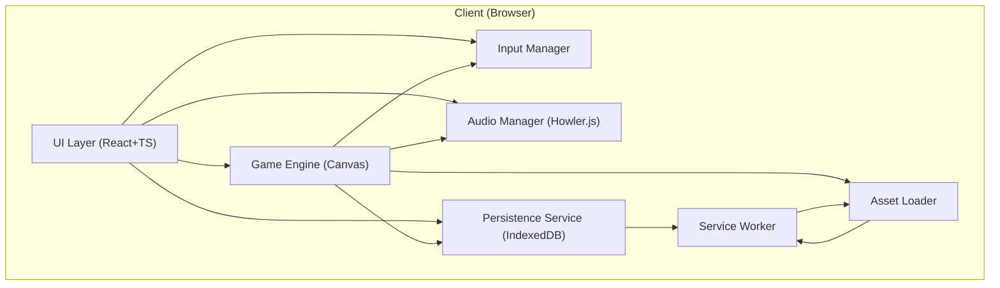

# Architect Mission Report

**Agent**: architect  
**Generated**: 2026-08-06T14:58:14.387Z

---

## Architecture Style

Modular client‑side monolith (single‑page application)

## Components

- **UI Layer** (Frontend UI): React + TypeScript component tree that renders menus, score, lives, high‑score list and hosts the Canvas element.
- **Game Engine** (Game Logic & Rendering): Core loop running at 60 fps, draws the maze and sprites on an HTML5 Canvas, updates positions, handles collisions and level progression.
- **Input Manager** (Input Handling): Normalises keyboard, WASD, on‑screen button clicks and swipe gestures into directional commands for the engine.
- **Audio Manager** (Audio Playback): Plays background music, sound effects and respects the mute toggle; uses a single audio context for low latency.
- **Persistence Service** (Client‑side Data Store): Stores top‑10 high scores, player settings (color‑blind mode, mute) in IndexedDB and provides a simple API for the UI and engine.
- **Asset Loader** (Static Asset Management): Loads sprite sheets, audio files and level data; caches them via the Service Worker for offline use.
- **Service Worker** (Offline & Caching Layer): Implements a PWA cache‑first strategy for all game assets and IndexedDB data, enabling full offline play after the first load.

## Tech Stack

- **Frontend UI**: React 18 with TypeScript — React offers a mature ecosystem, JSX makes canvas integration straightforward, and TypeScript adds compile‑time safety. Vue and Svelte are viable but would require additional learning for the team and have smaller community resources for game‑style UI patterns.
- **Game Engine / Rendering**: Custom TypeScript engine using HTML5 Canvas API — The game logic is simple and tightly coupled to the classic Pac‑Man mechanics; a custom engine keeps bundle size under 2 MB. Phaser and PixiJS add unnecessary abstraction and increase payload size for a project that only needs basic sprite animation.
- **Input Handling**: Custom TypeScript module (Keyboard, Touch, Swipe) — Direct DOM events give full control over keyboard and simple swipe handling without extra dependencies. Hammer.js is overkill for four directional gestures, and gamepad support is not a requirement.
- **Audio**: Howler.js 2.x — Howler abstracts cross‑browser audio quirks, provides simple API for sound effects and music, and keeps the codebase small. Native Web Audio is lower‑level and would increase development effort; Tone.js is oriented toward music synthesis, not simple effect playback.
- **Persistence**: IndexedDB via idb library — IndexedDB handles structured data (high‑score objects) efficiently and works offline. localStorage is limited to ~5 MB and synchronous, which can block the UI; WebSQL is deprecated and not supported in all browsers.
- **Asset Loading & Build**: Vite (ESBuild) with dynamic imports — Vite provides lightning‑fast dev server, tree‑shaking, and small production bundles, helping stay under the 2 MB limit. Webpack is heavier to configure; Parcel offers zero‑config but has slower cold starts.
- **Service Worker / Offline**: Workbox 6.x — Workbox supplies proven caching strategies, precaching, and runtime routing with minimal code. Writing a custom SW would duplicate this logic and increase risk of bugs; sw-precache is older and less actively maintained.
- **Testing**: Jest + React Testing Library for unit, Cypress for end‑to‑end — Jest integrates well with Vite and TypeScript, while React Testing Library encourages testing UI behavior. Cypress provides reliable browser‑level tests for game flow. Mocha requires more setup; Playwright is powerful but adds extra runtime overhead for a simple SPA.
- **CI/CD**: GitHub Actions deploying to GitHub Pages — GitHub Actions runs directly in the same repository, requires no external service, and GitHub Pages serves static assets efficiently. CircleCI/Netlify and GitLab/Vercel are fine but introduce extra accounts and configuration for a purely static site.

## Epics

- **E1** Core Game Engine: Implement maze layout, Pac‑Man movement, dot and power‑pellet consumption, scoring, level completion detection, and the main render loop.
- **E2** Ghost AI: Create four ghosts with distinct chase behaviours, implement chase/scatter timer, scared state handling, eye‑return logic, and point escalation for successive ghost eats.
- **E3** Player Input System: Support keyboard (arrow keys & WASD), on‑screen directional buttons for touch devices, and swipe gestures; ensure input is debounced and fed into the engine.
- **E4** Audio Subsystem: Integrate all required sound effects and background siren, implement mute toggle, and vary siren pitch/speed with level progress.
- **E5** User Interface Screens: Build start screen, countdown, pause overlay, level‑complete transition, game‑over screen with high‑score entry, and persistent high‑score display.
- **E6** Persistence & Settings: Store top‑10 high scores, player initials, color‑blind mode flag, and mute preference in IndexedDB; expose APIs for read/write.
- **E7** Accessibility Features: Ensure full keyboard navigation, visible focus outlines, ARIA labels on menus, and provide a color‑blind‑friendly palette toggle.
- **E8** Performance & Responsiveness: Optimize rendering to maintain 60 fps on low‑end devices, implement responsive canvas scaling, and keep total bundle size under 2 MB.
- **E9** Offline Support (PWA): Add Service Worker with precaching of all assets, enable install prompt, and guarantee the game works without network after first load.
- **E10** Bonus Fruit & Level Scaling: Spawn bonus fruit at the correct dot counts, vary fruit type and points per level, and increase ghost speed / reduce scared time for higher levels.

## Architecture Diagram

