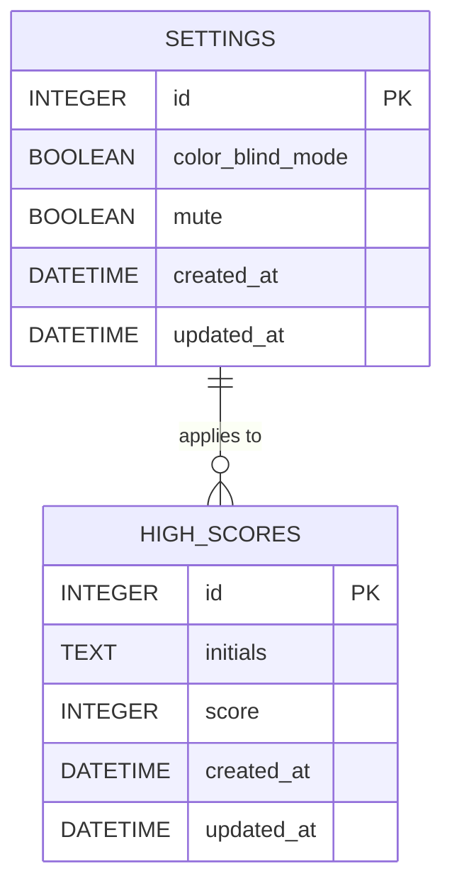

# DBA Mission Report

**Agent**: dba  
**Generated**: 2026-08-06T14:59:14.460Z

---

## Database Engine: IndexedDB (via idb library)

IndexedDB provides a native, asynchronous, key‑value store in the browser that works offline, supports complex objects, and scales to the modest data volume required for high‑score and player‑settings persistence. Using the idb wrapper gives a promise‑based API that integrates cleanly with TypeScript and the rest of the client‑side stack without adding a server component.

## Entities (2)

- **high_scores**: 5 columns
- **settings**: 5 columns

## ERD

